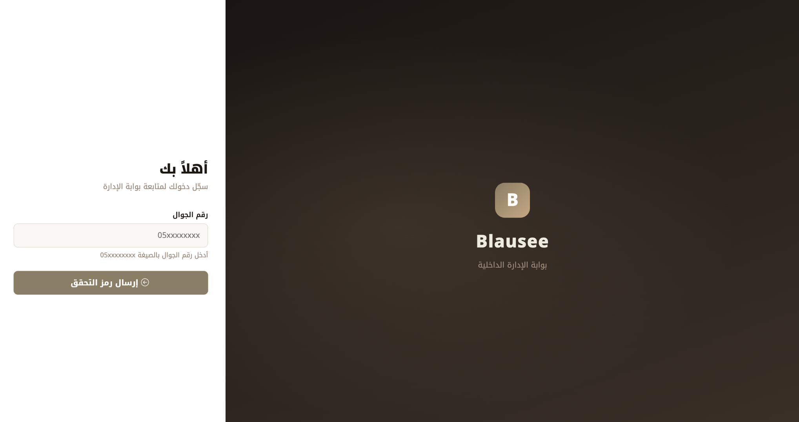

# Blausee Booking Management System

A real-world web-based booking platform designed to simplify chalet reservations, improve booking visibility, and support day-to-day operational management through a centralized digital experience.

## Project Overview

Blausee was developed to provide customers with a streamlined online booking journey while giving the business a structured way to manage reservations and operational information.

The platform includes chalet listings, availability and booking flows, customer verification, and a dedicated internal administration portal.

Internal administration screenshots containing customer or operational information are intentionally excluded to protect privacy and business data.

## My Role

**Project Lead | Product & Requirements Coordination**

My role focused on leading the project from the business and delivery side, translating operational needs into clear product requirements and coordinating the work through iterative releases.

### Key Responsibilities

- Gathered and clarified business requirements with the project owner.
- Translated business needs into product features and functional requirements.
- Defined and prioritized features based on business and operational needs.
- Managed project follow-up, milestones, and delivery expectations.
- Coordinated development activities and iterative releases.
- Reviewed delivered features and provided feedback for improvement.
- Supported testing, validation, and acceptance of delivered functionality.
- Ensured the booking and administration workflows aligned with operational requirements.
- Identified opportunities for product improvement and future automation.

## Agile Delivery Approach

The project followed an **Agile-inspired iterative delivery approach**.

Instead of waiting for the complete platform to be finished before delivery, features were divided into smaller sets of requirements and delivered over defined time periods.

Each iteration followed a cycle of:

**Requirements → Prioritization → Development → Review → Feedback → Next Delivery**

This approach allowed requirements and product features to be refined continuously based on practical feedback during the project.

## Key Product Capabilities

- Chalet listing and property presentation
- Chalet availability calendar
- Online reservation flow
- Customer information capture
- Mobile verification
- Booking confirmation process
- Internal administration portal
- Reservation management
- Booking status visibility
- Centralized operational booking information

## Product Screenshots

### Chalet Listing

### About Blausee

### Booking & Availability

### Administration Portal

> Internal administration screens containing customer, reservation, or operational data are intentionally not published.

## Skills Demonstrated

- Project Coordination
- Business Requirements Analysis
- Requirements Engineering
- Product Coordination
- Stakeholder Communication
- Agile Delivery
- Iterative Product Development
- Feature Prioritization
- Testing & Validation
- Acceptance Review
- Digital Product Improvement
- Booking Process Analysis

## Project Type

**Real-World Digital Product Project**

This repository is presented as a professional portfolio case study focused on project leadership, requirements coordination, product delivery, and digital solution development.

Sensitive customer information, credentials, internal configurations, and confidential operational data are intentionally excluded.
